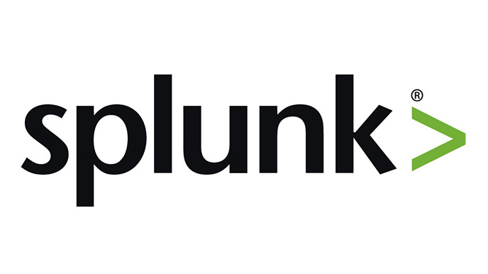

# Hello, I'm Sweetha

I am a job seeker with a profound interest in technology and a dedication to solving complex problems.I have completed CyberSecurity course and seeking to leverage academic knowledge and practical understanding of cybersecurity principles in the role of a cybersecurity analyst.

## Objective

My journey in computer science has led me to develop a passion for cybersecurity, and I would like to offer my learning experience in network security controls, digital forensics, risk assessment and incident response from my course at respected tech firms. Adept at identifying potential vulnerabilities, mitigating risks, and maintaining the confidentiality and integrity of data. Eager to bring strong critical thinking skills, attention to detail and a passion for protecting sensitive information to a dynamic team. Committed to continuous learning and staying up to date with the latest cybersecurity trends and threats to effectively contribute to an organization’s security posture.

## Skills

| Skill                                                     | Associated Project         |
|-----------------------------------------------            |----------------------------|
| Network Protocol Analyser Basics(WireShark)               | <a href="https://github.com/SalaiSwetha/WireShark-Project.git">Detection Lab</a>|
| Microsoft-Windows-Defender-Antivirus and Firewall         | <a href="https://github.com/SalaiSwetha/Microsoft-Windows-Defender-and-Firewall-.git">Detection Lab</a>
| Security Audit                                            | <a href="https://github.com/SalaiSwetha/SecurityAudit">Botium Toys Security Audit</a> |
|SIEM Implementation and Log Analysis                       | <a href="https://github.com/SalaiSwetha/Splunk.git">Detection Lab</a>|
 
## Tools

### Network

   
   
   

### SIEM

      

## Certifications

